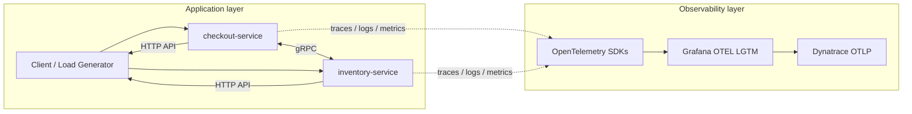
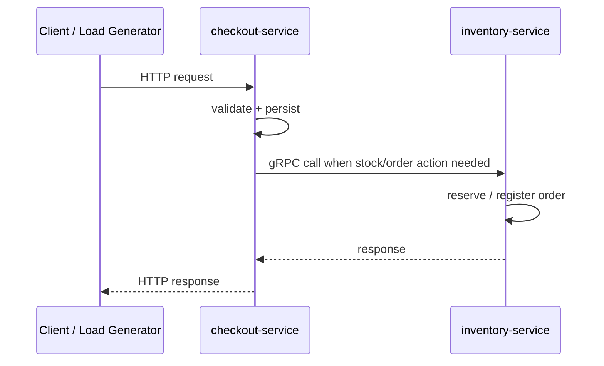

# Micro Market

Micro Market is a small microservices demo built to show practical OpenTelemetry use across tracing, logging, and metrics. The project is designed for a technical interview setting, so it stays intentionally simple while still covering the core observability flow end to end.

## Table of Contents

- [Overview](#overview)
- [Why This Project Exists](#why-this-project-exists)
- [Architecture](#architecture)
- [Services](#services)
- [Repository Structure](#repository-structure)
- [Observability](#observability)
- [Communication Flow](#communication-flow)
- [Running](#running)
- [Tools Used](#tools-used)
- [AI Usage](#ai-usage)
- [Resources](#resources)

## Overview

[Back to contents](#table-of-contents)

Micro Market uses a microservices architecture with two business services:

- `checkout-service` manages users, orders, and product-related checkout actions.
- `inventory-service` manages products and stock reservations.

The services talk through gRPC for internal communication and expose HTTP APIs for direct interaction. OpenTelemetry is used to trace requests, capture logs, and export metrics so service behavior can be inspected quickly when something goes wrong.

## Why This Project Exists

[Back to contents](#table-of-contents)

The main goal is to demonstrate understanding of observability fundamentals, not to build a complex product. The project is useful in interviews because it shows:

- how services are split in a microservices system,
- how cross-service calls are traced,
- how telemetry helps debug latency and failures,
- how the same app can run locally with Docker or in Kubernetes.

## Architecture

[Back to contents](#table-of-contents)

The system centers around two application services plus a telemetry stack.



The `grafana/otel-lgtm` container provides a local observability backend, while the same collector can forward telemetry to Dynatrace for the interview demo.

## Services

[Back to contents](#table-of-contents)

### `checkout-service`

Handles product management and order flows on the checkout side. It exposes HTTP routes and gRPC handlers, and uses the inventory service when it needs stock-related checks.

### `inventory-service`

Owns product stock and reservation logic. It exposes HTTP routes and gRPC handlers, and calls checkout when order registration needs to stay in sync.

## Repository Structure

[Back to contents](#table-of-contents)

```text
micro_market/
├── checkout-service/        checkout app, HTTP API, gRPC server, models, DB setup
├── inventory-service/       inventory app, HTTP API, gRPC server, models, DB setup
├── common/                  shared OpenTelemetry, JSON, error, and utility helpers
├── proto/                   protobuf contracts for service APIs
├── gen/                     generated gRPC and protobuf code
├── cmd/load-generator/      traffic generator binary
├── scripts/                 helper scripts for local Kubernetes and load generation
├── k8s/                     Kubernetes manifests and customization
└── docker-compose.yml       local multi-container stack
```

## Observability

[Back to contents](#table-of-contents)

OpenTelemetry is the main theme of the project:

- tracing shows service-to-service request paths,
- logs help inspect request flow and errors,
- metrics provide a quick view of service health.

Telemetry is exported through the local collector stack and can also be routed to Dynatrace. This makes it easy to compare local behavior with a real observability backend.

| Dynatrace                                          | Grafana                                        |
| -------------------------------------------------- | ---------------------------------------------- |
|       |       |
|  |  |

## Communication Flow

[Back to contents](#table-of-contents)

The main interaction path is:

1. A client or the load generator calls an HTTP endpoint.
2. The receiving service performs local validation and DB work.
3. If stock or order coordination is needed, the service calls the other service over gRPC.
4. Both services emit telemetry spans, logs, and metrics.



## Running

[Back to contents](#table-of-contents)

You have 3 ways to run and play with the project.

### Local

Run services directly with Go:

```bash
INVENTORY_SERVICE_ADDRESS=localhost:9090 GRPC_PORT=8080 HTTP_PORT=8888 make run_checkout
CHECKOUT_SERVICE_ADDRESS=localhost:8080 GRPC_PORT=9090 HTTP_PORT=9999 make run_inventory
docker run -p 3000:3000 -p 4317:4317 -p 4318:4318 --rm -ti grafana/otel-lgtm
```

### Docker Compose

Use `docker-compose.example.yml` as a reference if you want to plug in your own external collector config. That part is optional.

```bash
docker compose up --build
docker compose down
```

### Kubernetes

Make sure `kubectl` and `kind` are installed, then make scripts executable and run:

Use `k8s/secrets.example.yaml` as a reference if you want to plug in your own external collector config. That part is optional.

```bash
chmod +x ./scripts/*.sh
./scripts/k8s-up.sh
./scripts/k8s-down.sh
```

Use `./scripts/port-forward.sh` to expose services locally.

## Tools Used

[Back to contents](#table-of-contents)

- Go packages: used for service implementation, HTTP APIs, gRPC, and telemetry wiring.
- Grafana `docker-otel-lgtm`: local observability backend for logs, metrics, and traces.
- Docker Compose: quick multi-service local bootstrap.
- Kubernetes and kind: repeatable cluster-based deployment.
- gRPC: internal service communication.

## AI Usage

[Back to contents](#table-of-contents)

I used AI for:

- research,
- generating internal tooling like `cmd/load-generator`,
- implementing Docker image and compose deployment pieces,
- Kubernetes grcluster configuration and scripts,
- improving the `Makefile` for better developer experience.

`.cursor/` tree:

```text
.cursor/
├── rules/
│   ├── Caveman.mdc
│   └── General-Project-Rules.mdc
└── skills/
    └── caveman/
        └── SKILL.md
```

## Resources

[Back to contents](#table-of-contents)

- [https://github.com/open-telemetry/opentelemetry-demo](https://github.com/open-telemetry/opentelemetry-demo)
- [https://www.dynatrace.com/news/blog/opentelemetry-demo-application-with-dynatrace/](https://www.dynatrace.com/news/blog/opentelemetry-demo-application-with-dynatrace/)
- [https://docs.dynatrace.com/docs/ingest-from/opentelemetry/otlp-api](https://docs.dynatrace.com/docs/ingest-from/opentelemetry/otlp-api)
- [https://opentelemetry.io/docs/languages/go/instrumentation/](https://opentelemetry.io/docs/languages/go/instrumentation/)
- [https://opentelemetry.io/docs/collector/](https://opentelemetry.io/docs/collector/)
- [https://grpc.io/docs/languages/go/basics/](https://grpc.io/docs/languages/go/basics/)
- [https://www.lucavall.in/blog/opentelemetry-a-guide-to-observability-with-go](https://www.lucavall.in/blog/opentelemetry-a-guide-to-observability-with-go)
