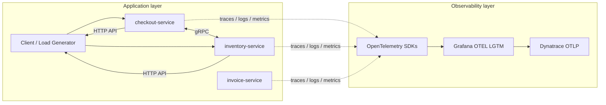
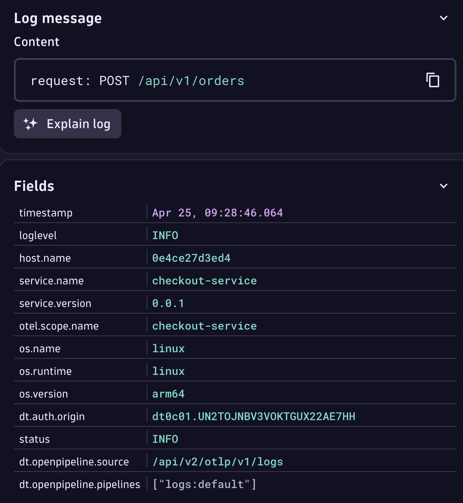
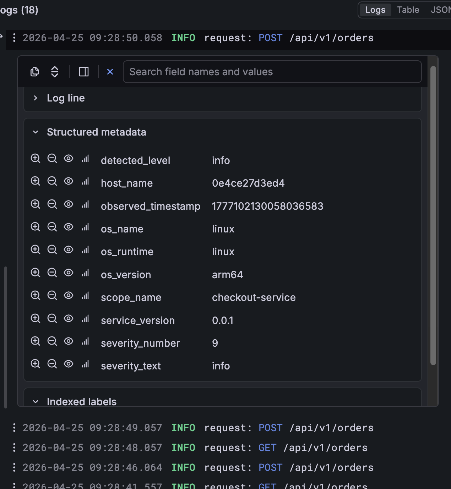
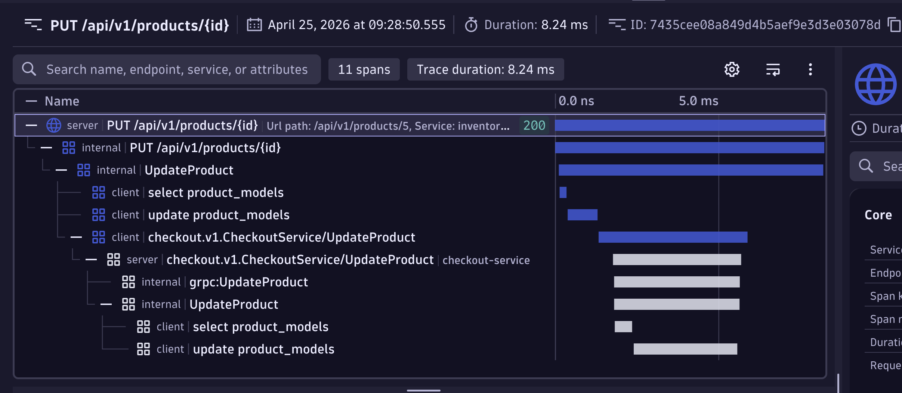
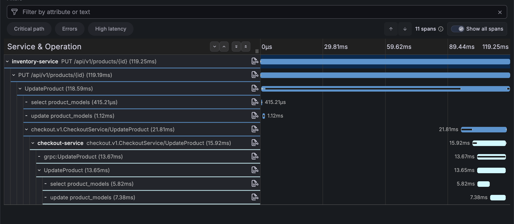
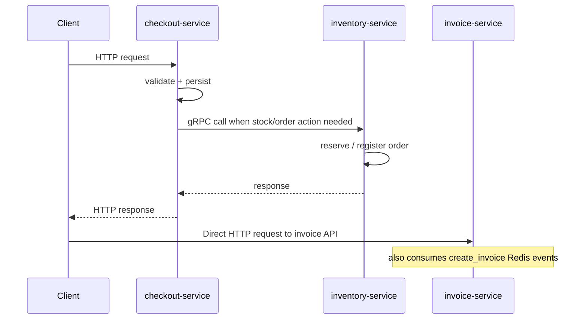

# Micro Market

Micro Market is a small microservices demo built around checkout, inventory, and invoice workflows. The repo mixes Go and C services: checkout and inventory focus on request handling and telemetry, while `invoice-service` stores invoice data in SQLite, listens to Redis events, and generates PDFs in C.

## Table of Contents

- [Overview](#overview)
- [Why This Project Exists](#why-this-project-exists)
- [Architecture](#architecture)
- [Services](#services)
- [Repository Structure](#repository-structure)
- [Observability](#observability)
- [Communication Flow](#communication-flow)
- [Running](#running)
- [Tools Used](#tools-used)
- [AI Usage](#ai-usage)
- [Resources](#resources)

## Overview

[Back to contents](#table-of-contents)

Micro Market uses a microservices architecture with three business services:

- [`checkout-service`](./checkout-service) manages user checkout flows and order actions.
- `inventory-service` manages products and stock reservations.
- [`invoice-service`](./invoice-service) creates invoices, stores them in SQLite, and generates PDFs.
- [`custom-collector`](./custom-collector) is a custom collector that can be used to collect telemetry data from the services.

The services expose HTTP APIs and use gRPC or Redis where cross-service coordination is needed. OpenTelemetry traces requests, captures logs, and exports metrics so service behavior can be inspected quickly when something goes wrong.

## Why This Project Exists

[Back to contents](#table-of-contents)

The main goal is to demonstrate understanding of observability fundamentals, not to build a complex product. The project is useful in interviews because it shows:

- how services are split in a microservices system,
- how cross-service calls are traced,
- how telemetry helps debug latency and failures,
- how the same app can run locally with Docker or in Kubernetes.

## Architecture

[Back to contents](#table-of-contents)

The system centers around three application services plus a telemetry stack.



The `grafana/otel-lgtm` container provides a local observability backend, while the same collector can forward telemetry to Dynatrace for the interview demo.

## Services

[Back to contents](#table-of-contents)

### `checkout-service`

Handles product management and order flows on the checkout side. It exposes HTTP routes and gRPC handlers, and uses the inventory service when it needs stock-related checks.

### `inventory-service`

Owns product stock and reservation logic. It exposes HTTP routes and gRPC handlers, and calls checkout when order registration needs to stay in sync.

### `invoice-service`

Receives invoice creation requests over HTTP, persists invoice data in SQLite, listens for Redis events, and generates invoice PDFs.

### `custom-collector`

A custom collector that can be used to collect telemetry data from the services.

## Repository Structure

[Back to contents](#table-of-contents)

```text
micro_market/
├── checkout-service/        checkout API, gRPC client/server code, DB layer, models
├── inventory-service/       inventory API, gRPC client/server code, DB layer, models
├── invoice-service/         invoice API, SQLite persistence, Redis consumer, PDF generation
├── common/                  shared OpenTelemetry, JSON, error, and utility helpers
├── proto/                   protobuf contracts for service APIs
├── gen/                     generated gRPC and protobuf code
├── cmd/load-generator/      traffic generator binary
├── scripts/                 local setup, port-forwarding, and Kubernetes helpers
├── k8s/                     Kubernetes manifests and overlays
├── custom-collector/        custom OpenTelemetry collector build and processor
├── docker-compose.yml       local multi-container stack
└── otelcol-config.yaml      local collector configuration
```

## Observability

[Back to contents](#table-of-contents)

OpenTelemetry is the main theme of the project:

- tracing shows service-to-service request paths,
- logs help inspect request flow and errors,
- metrics provide a quick view of service health.

Telemetry is exported through the local collector stack and can also be routed to Dynatrace. This makes it easy to compare local behavior with a real observability backend.

| Dynatrace                                          | Grafana                                        |
| -------------------------------------------------- | ---------------------------------------------- |
|       |       |
|  |  |

## Communication Flow

[Back to contents](#table-of-contents)

The main interaction path is:

1. A client or the load generator calls `checkout-service` or `inventory-service` over HTTP.
2. The receiving service validates the request and performs its local DB work.
3. When stock or order coordination is needed, `checkout-service` and `inventory-service` call each other over gRPC.
4. `invoice-service` exposes its own HTTP API, stores invoices in SQLite, and consumes `create_invoice` Redis messages to generate invoices and PDFs.
5. All services send traces, logs, and metrics through the OpenTelemetry stack.



## Running

[Back to contents](#table-of-contents)

You have 3 ways to run and play with the project.

### Local

Run services directly with Go:

For `invoice-service`, run `./scripts/install_invoice_service_deps_local.sh` first on a fresh machine. It installs the invoice service submodules and native dependencies required by the local build.

```bash
INVENTORY_SERVICE_ADDRESS=localhost:9090 GRPC_PORT=8080 HTTP_PORT=8888 make run_checkout
CHECKOUT_SERVICE_ADDRESS=localhost:8080 GRPC_PORT=9090 HTTP_PORT=9999 make run_inventory
REDIS_HOST=localhost REDIS_PORT=6379 make run_invoice
docker run -p 3000:3000 -p 4317:4317 -p 4318:4318 --rm -ti grafana/otel-lgtm
```

### Docker Compose

Use `docker-compose.example.yml` as a reference if you want to plug in your own external collector config. That part is optional.

```bash
cp docker-compose.example.yml docker-compose.yml
docker compose up --build
docker compose down
```

### Kubernetes

Make sure `kubectl` and `kind` are installed, then make scripts executable and run:

Use `k8s/secrets.example.yaml` as a reference if you want to plug in your own external collector config. That part is optional.

```bash
chmod +x ./scripts/*.sh
./scripts/k8s-up.sh
./scripts/k8s-down.sh
```

Use `./scripts/port-forward.sh` to expose services locally.

## Tools Used

[Back to contents](#table-of-contents)

- Go packages: used for service implementation, HTTP APIs, gRPC, and telemetry wiring.
- Grafana `docker-otel-lgtm`: local observability backend for logs, metrics, and traces.
- Docker Compose: quick multi-service local bootstrap.
- Kubernetes and kind: repeatable cluster-based deployment.
- gRPC: internal service communication.

## AI Usage

[Back to contents](#table-of-contents)

I used AI for:

- research,
- generating internal tooling like `cmd/load-generator`,
- implementing Docker image and compose deployment pieces,
- Kubernetes grcluster configuration and scripts,
- improving the `Makefile` for better developer experience.

`.cursor/` tree:

```text
.cursor/
├── rules/
│   ├── Caveman.mdc
│   ├── Clean-code.mdc
│   ├── Code-quality.mdc
│   ├── Docker-best-practices.mdc
│   ├── Docker-guidelines.mdc
│   ├── General-Project-Rules.mdc
│   └── Recommended-C-style-and-coding-rules.mdc
└── skills/
    └── caveman/
        └── SKILL.md
```

## Resources

[Back to contents](#table-of-contents)

- [https://github.com/open-telemetry/opentelemetry-demo](https://github.com/open-telemetry/opentelemetry-demo)
- [https://www.dynatrace.com/news/blog/opentelemetry-demo-application-with-dynatrace/](https://www.dynatrace.com/news/blog/opentelemetry-demo-application-with-dynatrace/)
- [https://docs.dynatrace.com/docs/ingest-from/opentelemetry/otlp-api](https://docs.dynatrace.com/docs/ingest-from/opentelemetry/otlp-api)
- [https://opentelemetry.io/docs/languages/go/instrumentation/](https://opentelemetry.io/docs/languages/go/instrumentation/)
- [https://opentelemetry.io/docs/collector/](https://opentelemetry.io/docs/collector/)
- [https://grpc.io/docs/languages/go/basics/](https://grpc.io/docs/languages/go/basics/)
- [https://www.lucavall.in/blog/opentelemetry-a-guide-to-observability-with-go](https://www.lucavall.in/blog/opentelemetry-a-guide-to-observability-with-go)
